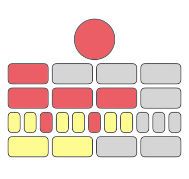
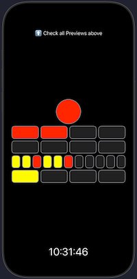
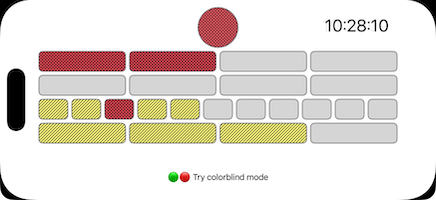
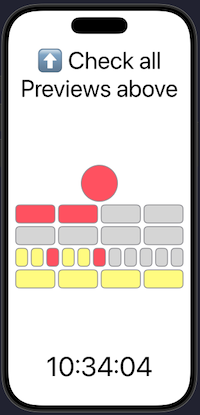
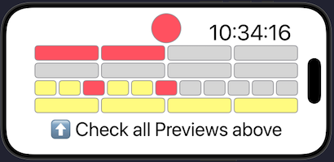

# BerlinClock
An iOS implementation of the kata https://github.com/stephane-genicot/katas/blob/master/BerlinClock.md

## Instructions

Clone this project and open `BerlinClock/BerlinClock.xcodeproj` with Xcode.
Inside Xcode, open `ClockView.swift` with the Canvas enabled to see different previews.

Alternatively, run the app on a simulator or device. You may need to set your own team in Xcode in `Targets -> BerlinClock -> Signing & Capabilities`.

## Kata considerations

### Commit style

In the spirit of working with an automated CI/CD, all commits must contain a project that compiles. However, when developing a test case prior to the feature, the test will fail even if the project compiles. Commits with failing test cases are marked with a '🔴' emoji in the commit message. When the project has been adapted for the test to pass, the next commit message has an identical message, but this time with a '🟢' emoji.

The commits were written using [Conventional Commits](https://www.conventionalcommits.org/en/v1.0.0/), however, the target version remains the same even though conventional commits would normally affect the [semantic versioning](https://semver.org/).

### Input trust

`ClockEngine` functions assume the hours, minutes and seconds are valid within their time unit ranges of a typical time.

### Avoiding premature optimizations

While some row-computing functions could have been more generalized through argument vars, the Kata revolves around a past, temporary historical artefact. The task at hand doesn't vouch for supporting other row sizes than 4 and 11, other lamp colors than red or yellow, or different lamp "capacities" than those specifically for the Berlin Clock.

If it were a requirement from the Kata, the functions would support arguments similar to `hourColor`, `minutesColor`, `minutesPerLamp`, `lampsPerRow` and `alternateColorSplit` instead.

### Time precision

In order to sync the Berlin Clock's rhythm with the OS's, a function computes the next rounded second before setting a timer that will trigger a once-per-second refresh of the clock's ViewModel. For example, if the function is run at 12:33:19.200, the timer will start at 12:33:20.000. This is done using `Timer(fire:)` which will fire at at the given (future) date.

As per `Timer(fire:)`'s implementation, if the date in argument happened to be in the past, it will fire immediately when added to the run loop. In a real project, a developer *could* unadvertedly add too much computing between setting the timer and adding it to the system's RunLoop, which in extreme cases could cause a noticeable lag. Considering the scope and readability of this Kata, this corner case will not be treated.

Note: The default value of `Timer.tolerance` is zero, which is as precise as we can get. Regardless of that value, `tolerance` may be overridden by the OS, e.g. for global power saving situations.

### Time vs Metronomes

The production version of this kata would visually refresh once per second. But to allow manipulating time, e.g. building a clock that advances rapidly, the ViewModel makes use of a TimeProvider and a Metronome. The TimeProvider provides a `now` variable to tell the ViewModel what the current time is. The Metronome sets a rhythm by calling a closure depending on its defined rhythm.

### Performance

In order to prevent unnecessary computing, the hour and minute rows are computed only if the corresponding hour, minute and second values actually changed since the last clock tick.

### Accessibility

There is no text to display in this Kata, but other accessibility measures can be taken through color management. Those implementations can be seen through the SwiftUI Previews of `ClockView` or by running the app on an iOS device or Simulator and editing accessibility settings.

### Usage of AI

IA was used for conversational brainstorming, e.g.:
* Is there a modern, Combine-equivalent of `Timer(fire:)`?
* What new features are available in Swift Testing compared to XCTest to reduce lines of code?
* What is a proper commit history to prove usage of TDD in the scope of a Kata?

IA was *not* used to produce this readme.
